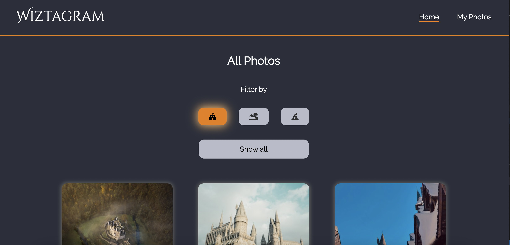
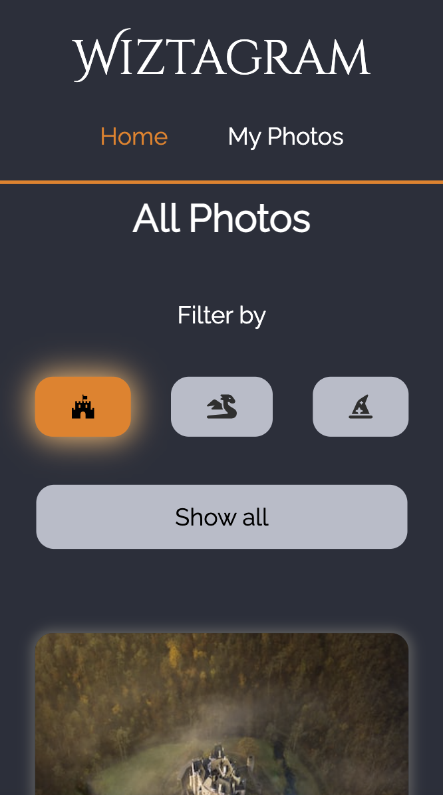
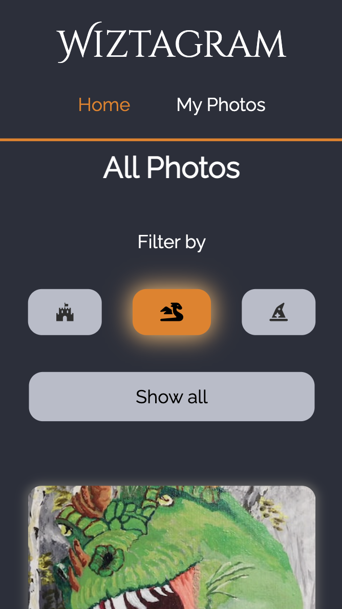
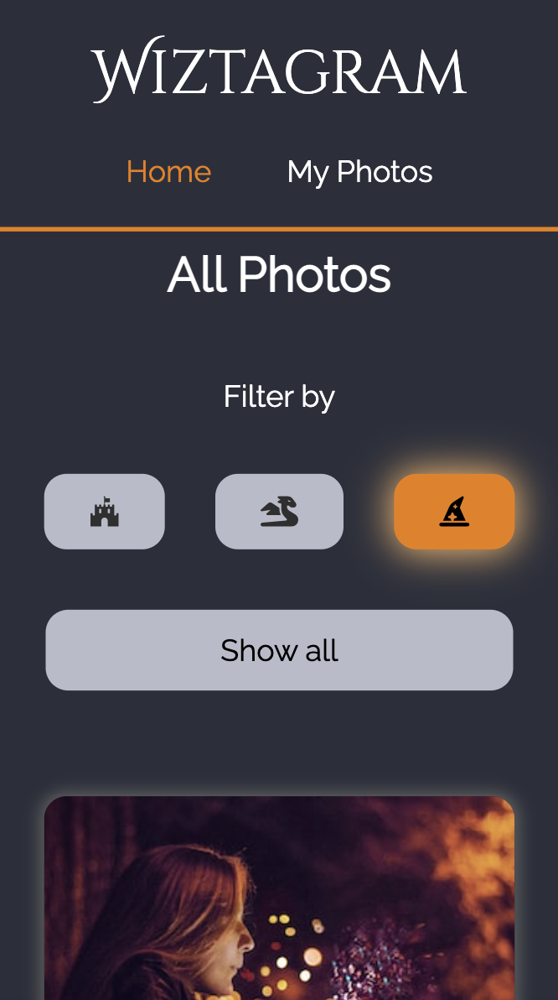
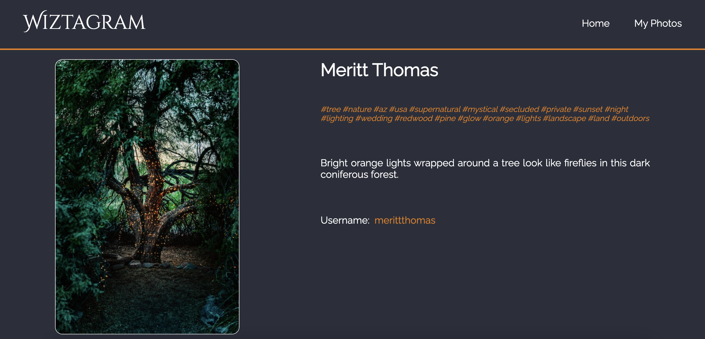
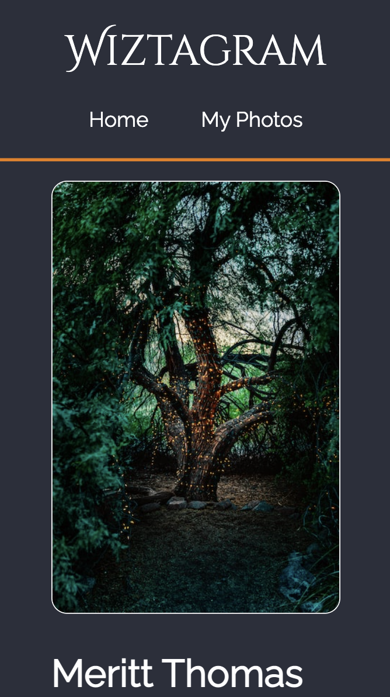

# Wiztagram

Wiztagram is a single page application built with React and the Redux pattern that fetches images from the Unsplash API based on predefined filter queries. The app allows you to browse through a gallery of magical images related to different filter categories.

[Click here to see the live demo](https://wiztagram.vercel.app/)

#### SonarCloud Metrics

## Features

### Filter by category

Wiztagram allows users to filter through different categories of magical images such as dragons, castles, and spells. Simply click on the corresponding button on the home page to browse through the gallery of images for each category. This feature makes it easy for users to find the specific types of magical images they are looking for.

 

### Responsive design

Wiztagram is designed to be fully responsive, ensuring that the application is accessible and easy to use on any device. One key aspect of this responsive design is the focus on image visibility. The app adjusts the size and layout of the images based on the device screen size, ensuring that the images are always visible and clear regardless of the device used. This ensures that users can browse through the gallery of magical images on their mobile devices, tablets, or desktops with ease, without having to zoom in or scroll horizontally to view the images.

 

## Future implementations

- User authentication with JWT
- Save your favorite photos in a personal list
- Customizable themes
- Additional filters
- Link to the Unsplash detail page of each photo
- Download photos directly from the app

## Getting started

To use Wiztagram, follow these steps:

- Clone the repository to your local machine.
- Install the dependencies by running npm install in your terminal.
- Obtain an access key from the Unsplash API and replace the ACCESS_KEY constant in src/api/unsplash.js with your own access key.

### Running the application

To run the application, use the following command:

<code>npm start</code>

Open your browser and navigate to http://localhost:3000/.

### Testing

To run the tests, use the following command:

<code>npm run test</code>
